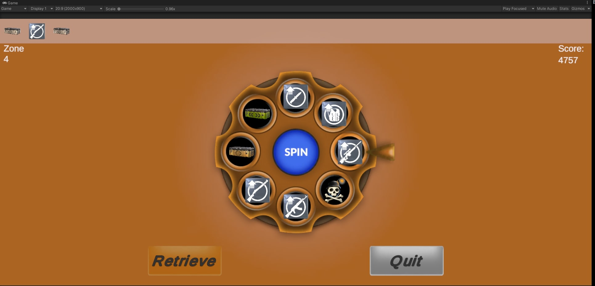
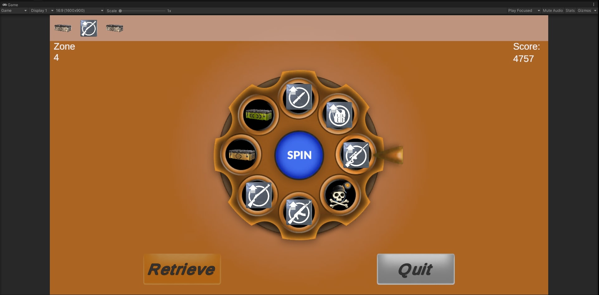
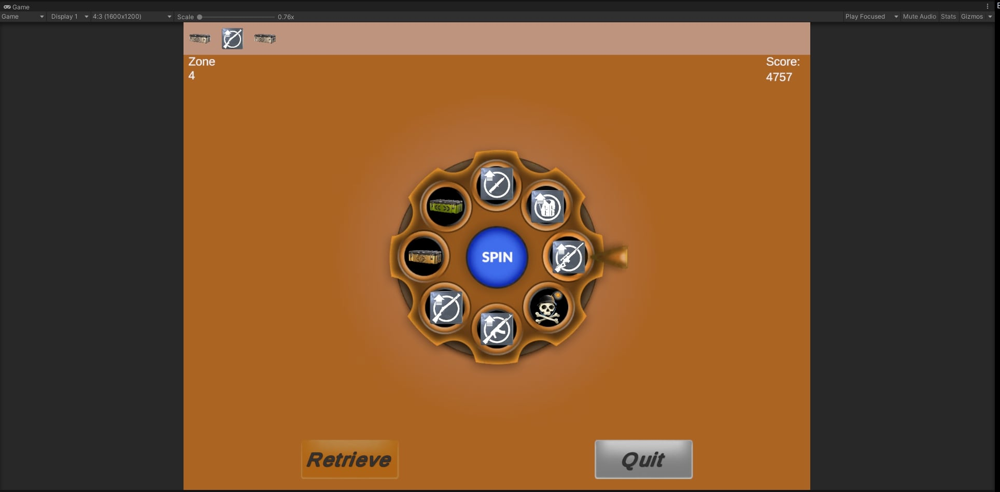

# 🎡 Wheel of Fortune - Vertigo Games Case Study

This project is a robust implementation of a "Wheel of Fortune" mobile game mechanic, developed as a technical case study. It features infinite level progression, a risk/reward system (Bomb/Revive), and a fully responsive UI optimized for all mobile aspect ratios.

## 🎥 Gameplay Demo
Click the image below to watch the gameplay video:

> **Note:** The video demonstrates the Spin Mechanics, Bomb/Revive logic, Reward Collection, and UI transitions.

---

## 📱 UI Responsiveness & Aspect Ratio Tests
The UI is engineered to maintain visual integrity across extreme aspect ratios using Unity's Canvas Scaler and custom anchor setups.

| 20:9 (Modern Phones) | 16:9 (Standard) | 4:3 (Tablets) |
| :---: | :---: | :---: |
|  |  |  |

---

## 🛠 Technical Architecture & Features

This project adheres to **SOLID principles** and avoids "Spaghetti Code" by strictly separating Logic, Data, and Presentation layers.

### 🔹 Core Systems
* **ScriptableObject Architecture:** All Zone data (Bronze, Silver, Gold), Wheel Slices, and Themes are data-driven.
* **Infinite Progression:** The game loops through 30 zones data-wise but presents an infinite level counter (Level 1 -> Level ∞) to the player.
* **Event-Driven Communication:** Managers and UI controllers communicate via C# Actions (`OnSpinFinished`, `OnZoneLoaded`), reducing dependency.

### 🔹 Optimizations & Code Quality
* **IL2CPP & ARM64:** Built using IL2CPP backend for maximum security and performance on modern Android devices.
* **UI Optimization Tool:** A custom Editor Tool (`Tools/Vertigo/Optimize UI`) was written to automatically disable `RaycastTarget` on non-interactive UI elements to reduce overdraw and input overhead.
* **Extension Methods:** `DOTweenExtensions` are used to prevent code duplication for UI animations (Pop, Press, Shake).
* **Refactored Controllers:** `WheelController` handles pure logic, while visual feedback is delegated to decoupled systems.

### 🔹 Mechanics
* **Risk & Reward:** "Bomb" slices trigger a revive/give-up decision flow.
* **Safe & Super Zones:** Every 5th zone is Safe (No Bomb), Every 30th zone is Super (High Rewards).
* **Dynamic Filling:** Wheel slices are populated dynamically based on the current Zone configuration.

---

## 📦 Installation

You can download the production-ready APK from the Releases page.

1.  Go to **[Releases](../../releases)**.
2.  Download `Wheel_Of_Fortune.apk`.
3.  Install on any Android device (Android 5.0+).

---

**Developed by Birol Yeşiloğlu** *Unity 2021 LTS - DOTween*
